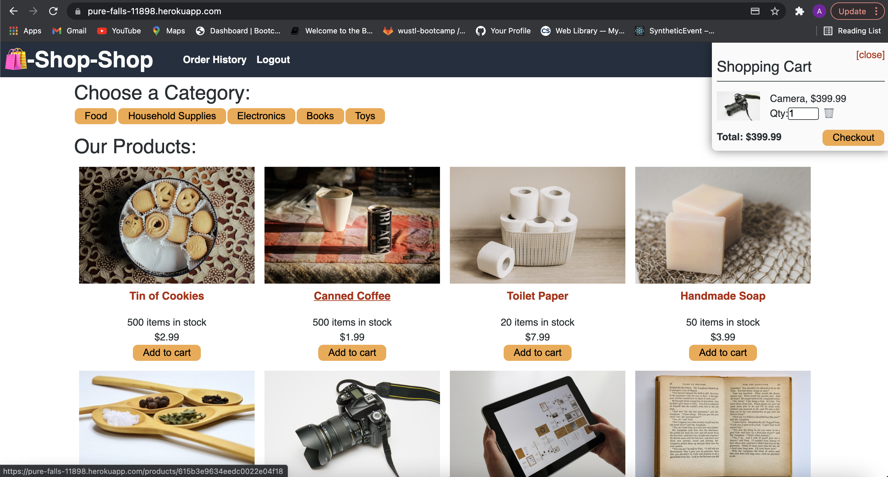
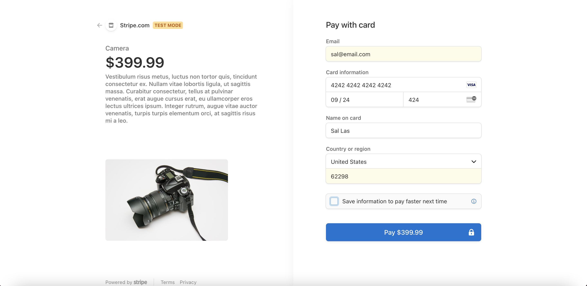
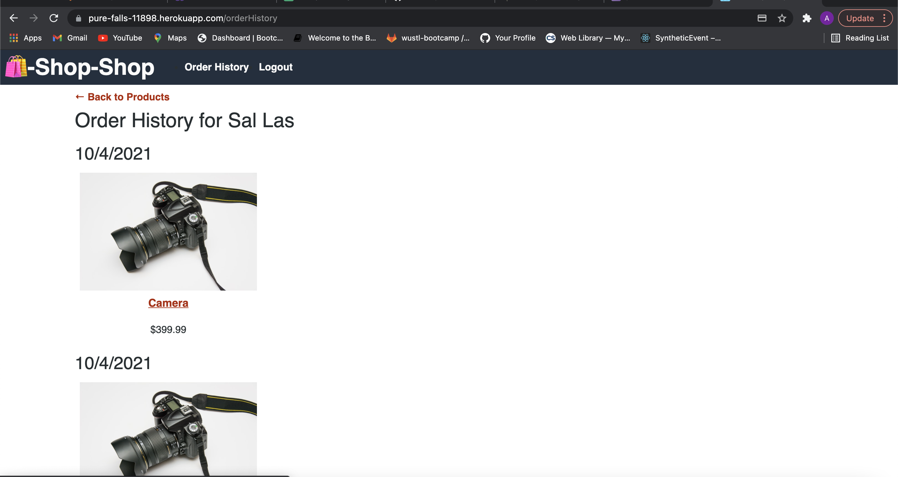

# Redex Store

## Description
This is a e-commerce style application that has been refactored to use Redux for global state rather than context API.
## Contents
* [Installation](#Installation)
* [Usage](#Usage)
* [Demo](#Demo)
* [Deployment](#Deployment)
* [Built With](#built-with)
* [License](#License)
* [Contact](#Contact)
## Installation
To start using this E-Commerce Store App you must follow these instructions:

Fork and clone this repository and save it to your computer. For help how to fork and clone click [here](https://guides.github.com/activities/forking/)

Open your terminal and make sure node.js is installed. To download node.js click [here](https://nodejs.org/en/download/)

Run command npm i to install all the dependencies in this repository.

Once all the packages have been installed, CD into the SERVER level of the file structure and run

npm run develop

Once you run the above command it will invoke frontend and backend server and the application will run on http://localhost:3000/ .
 
## Usage
A user can add or remove items to their cart once logged in. Payments are handled by Stripe. Once a transaction is complete the user can also view  their order history to see their previous transactions.

## Demo

## Deployment
- [Deployed Application](https://pure-falls-11898.herokuapp.com/)
- [Github Repo](https://github.com/akays89/reduxStore)

## Built With
JavaScript, HTML, CSS, React, Redux, Stripe, bcrypt, Mongoose, Express, node.js, Apollo, GraphQL and JSON Web Token.

## License
MIT

## Contact
Please feel free to contact me at amandakays89@gmail.com for questions or feedback. 
To see other projects, please visit https://github.com/akays89/.
